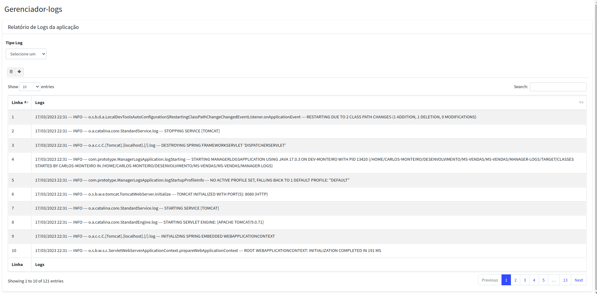

# Gerenciador-logs
Projeto consiste em disponibilizar um endpoint que promova um Gerenciador visual dos logs da aplicação, podendo ser Filtrado 
pelos tipo : DEBUG, INFO, WARN, ERROR e FATAL. Permite também a realização do download e limpeza do arquivo.

 # Tecnologias e ferramentas usadas
 * Spring boot - Framework utilizada com a arquitetura MVC.
 * Lombok - para Gerar os construtores e os métodos Getter e Setter no projeto..
 * Spring-boot-devtools - Pela facilidade no reload ao realizar uma modificação.
 * Java 17 - usado no código fonte.
 * thymeleaf - para a construção da tela com atributos dinâmicos.
 * SLF4J - permite desacoplar o código que é usado para criar eventos de log da implementação que será responsável por processá-los 
 e armazená-los em um arquivo.

# Executando o projeto

## Existe duas formas de execultar o projeto: 
* Com o código fonte, neste é necessário executar o arquivo "ManagerLogsApplication.java", como "Java application" ou executando o comando mvn spring-boot:run

Após a execução do projeto, pode ser acessado na url http://localhost:8080/logs?type=

# Telas do projeto 

### Home parte 1

  

